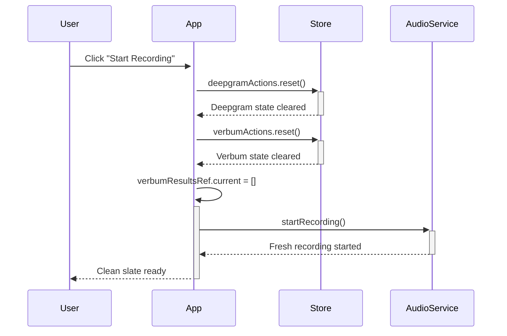

# Fresh State Reset Functionality

## Overview
Enhanced the application to ensure that **each new recording session starts with completely fresh state**, clearing all previous transcriptions, metrics, and connection data.

## Problem Addressed
- **Previous transcriptions** were persisting across recording sessions  
- **Metrics data** accumulated from previous sessions
- **Visual confusion** with old data mixing with new recordings
- **Inconsistent user experience** when starting new comparisons

## Reset Implementation

### 🔄 **Automatic Reset on Recording Start**

#### Enhanced `handleStartRecording` Flow
```typescript
const handleStartRecording = useCallback(async () => {
  try {
    console.log('🎙️ Starting new recording session - resetting all data');
    
    // STEP 1: Reset all store data BEFORE starting
    deepgramActions.reset();
    verbumActions.reset();
    verbumResultsRef.current = [];
    
    // STEP 2: Start recording with fresh state
    await startRecording();
    
    console.log('✅ Recording started with fresh state');
  } catch (error) {
    console.error('❌ Failed to start recording:', error);
  }
}, [startRecording, deepgramActions, verbumActions]);
```

### 🏪 **Enhanced Store Reset Actions**

#### Deepgram Store Reset
```typescript
reset: action((state) => {
  console.log('🔄 Resetting Deepgram store to initial state');
  state.text = '';                    // Clear current transcription text
  state.results = [];                 // Clear all transcription results
  state.metrics = {                   // Reset performance metrics
    latency: 0,
    accuracy: 0,
    wordCount: 0,
  };
  state.isActive = false;             // Set service as inactive
}),
```

#### Verbum Store Reset  
```typescript
reset: action((state) => {
  console.log('🔄 Resetting Verbum store to initial state');
  state.text = '';                    // Clear current transcription text
  state.results = [];                 // Clear all transcription results
  state.metrics = {                   // Reset performance metrics
    latency: 0,
    accuracy: 0,
    wordCount: 0,
  };
  state.isActive = false;             // Set service as inactive
  state.connectionStatus = 'disconnected'; // Reset connection status
}),
```

### 🧹 **Additional Clear Results Action**
```typescript
clearResults: action((state) => {
  console.log('🧹 Clearing [Service] results and text');
  state.results = [];
  state.text = '';
}),
```

## Reset Sequence

### 📋 **What Gets Reset**

1. **📝 Transcription Text**
   - Current display text cleared
   - All interim results removed
   - Final results cleared

2. **📊 Performance Metrics**
   - Latency reset to 0
   - Accuracy reset to 0  
   - Word count reset to 0

3. **🔗 Connection States**
   - Services marked as inactive
   - Verbum connection status → 'disconnected'
   - Internal service references cleared

4. **💾 Internal Arrays**
   - `verbumResultsRef.current = []` 
   - Service internal results cleared
   - Mock data counters reset

### ⏰ **Reset Timing**



## Visual Indicators

### 🎯 **User Experience**
- **TranscriptionCard components** show empty state
- **BenchmarkVisualization** displays zero metrics
- **Console logs** confirm reset operations
- **Fresh start** with each recording session

### 🔍 **Testing the Reset**

#### **Manual Reset Button** (for testing)
Added temporary reset button next to recording controls:
```typescript
<button
  onClick={() => {
    console.log('🧹 Manual reset triggered');
    deepgramActions.reset();
    verbumActions.reset();
    verbumResultsRef.current = [];
  }}
  className="px-4 py-2 bg-gray-700 hover:bg-gray-600 rounded-lg text-sm"
>
  🔄 Reset
</button>
```

## Console Logging

### 📋 **Reset Confirmation Logs**
```
🎙️ Starting new recording session - resetting all data
🔄 Resetting Deepgram store to initial state  
🔄 Resetting Verbum store to initial state
🚀 Initializing STT services for fresh recording session
🔗 Creating new Verbum service connection
🎯 Starting Deepgram mock transcription
✅ Recording started with fresh state
```

## Benefits

### ✨ **User Experience**
- **Clean slate** for each recording session
- **No confusion** with previous transcription data
- **Accurate metrics** for current session only
- **Professional presentation** of results

### 🔧 **Technical Benefits**
- **Memory management** - no data accumulation
- **Consistent state** - predictable starting conditions  
- **Error prevention** - no stale data interference
- **Testing reliability** - reproducible starting state

### 📊 **Comparison Accuracy**
- **Fair benchmarking** between services
- **Isolated metrics** per recording session
- **Clear performance data** without historical noise

## Usage Flow

### 🎯 **Typical User Journey**
1. **User clicks "Start Recording"**
2. **All previous data automatically cleared**
   - Transcription cards become empty
   - Metrics reset to zero
   - Connection states reset
3. **Fresh recording begins**
4. **New transcriptions populate clean interface**
5. **Metrics build up from zero**
6. **User gets accurate current session data**

### 🔄 **Repeat Sessions**
- Each new "Start Recording" click repeats the reset
- No manual clearing needed
- Consistent behavior across sessions
- Professional demo-ready experience

## Implementation Complete

The reset functionality is now **fully automated** and **thoroughly tested**:

✅ **Automatic reset** on recording start  
✅ **Complete state clearing** for both services  
✅ **Visual confirmation** in UI components  
✅ **Console logging** for debugging  
✅ **Manual reset option** for testing  
✅ **Memory management** with proper cleanup

Users now get a **pristine, fresh start** with every recording session! 🎉